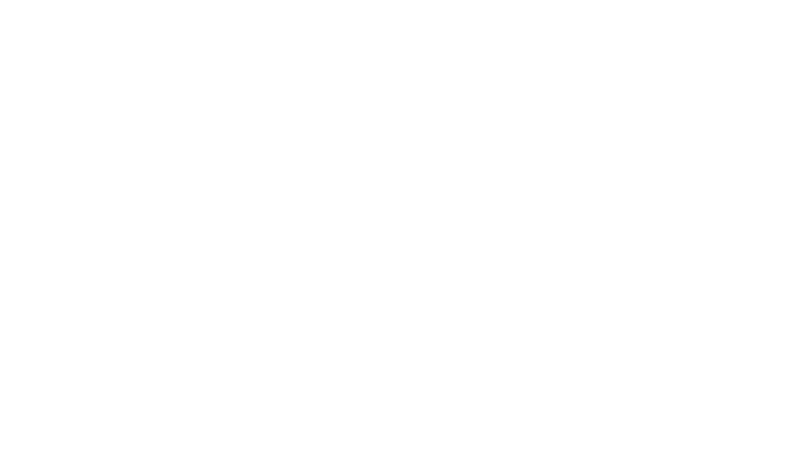

<h1 align="center">ghost</h1>

  

ghost is a work-in-progress web proxy. It will have unblocked games while also having a whole proxy (powered with Scramjet). I plan for this web proxy to look sleek and modern while also being fast and reliable. Support me for the first release!

###

## Progress Updates (MM/DD/YY)
5/4/26: Made this repository! 
5/5/26: Added barebones Scramjet template web proxy (Version 2.0.2-alpha), might redo sooner or later 
5/6/26: Removed barebones template, working on one from scratch using Scramjet 
5/10/26: Added Scramjet-App template (v1.1.0). Will redesign until next release of Scramjet-App. 
5/31/26: Since Scramjet V2 is basically out, created proxy-app via npm and added files from folder created from proxy-app. More updates coming very soon when docs come out!

## Developers
- lynverix - Main developer
- lynverix - Designer
- lynverix - Also a developer
